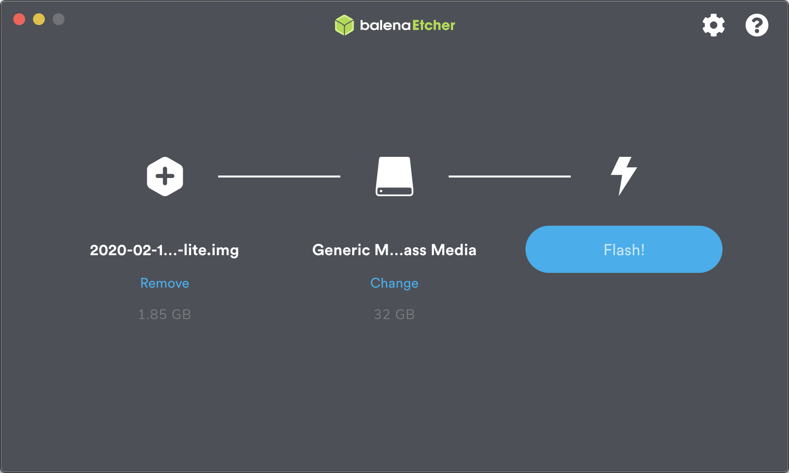
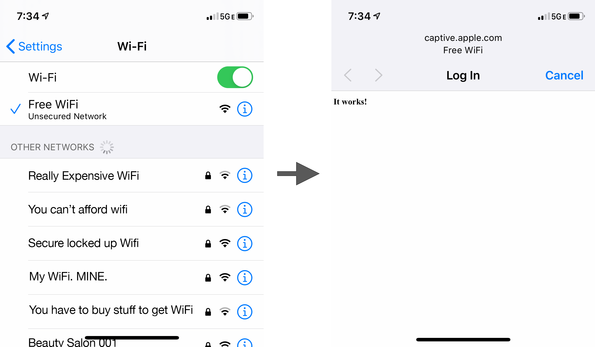
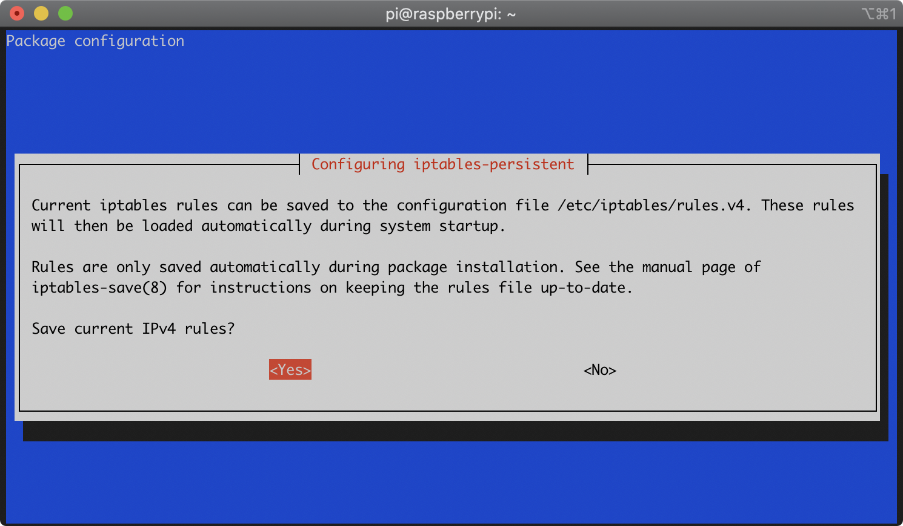
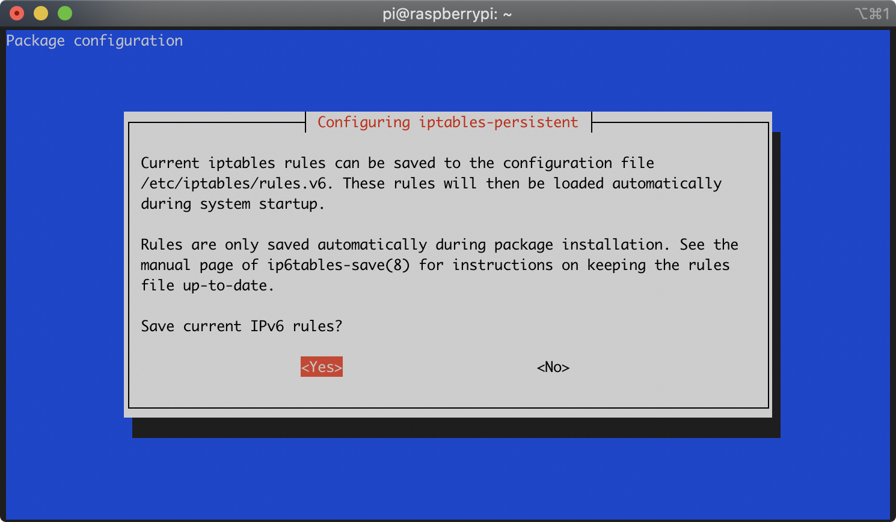
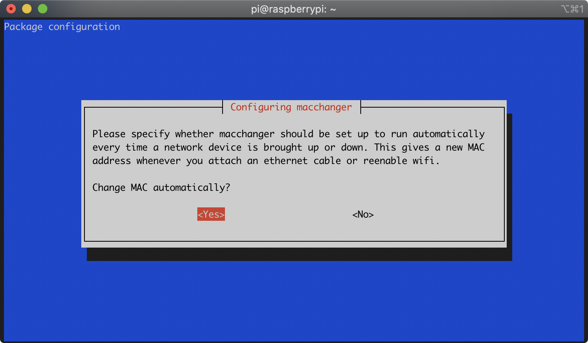

# Building a Rogue Captive Portal with the Raspberry Pi Zero W
May 18, 2020

I previously created a "Rogue Access Point" ([see project here](https://jerryryle.github.io/rogue_ap/)) that made a [Raspberry Pi Zero W](https://www.raspberrypi.org/products/raspberry-pi-zero-w/) act as a WiFi hotspot and serve up a Python web app to anyone who connected to it. That implementation specifically attempted to fool captive portal detection on devices so that they wouldn't pop up a captive portal connection dialog after connecting to the WiFi access point. It would then route all traffic to the Python web app so that when a user attempted to visit a website (for example, http://google.com) they would see the app instead.

That exercise was fun, but the push to use https everywhere detracted from its usefulness. Because the rogue access point can't have valid https certificates for most websites, the user is presented with a big security warning when they attempt to access any site via https. And, since many browsers now try https first, this makes the rogue access point useless (Hooray! The internet is getting better).

So, I decided to create a "Rogue Captive Portal." This will intentionally not fool captive portal detection on devices so that they do pop up the captive portal connection dialog after connecting to the WiFi access point. This (currently) will happily show http content, so you're able to harass users with entertaining messages or present something that looks like a Google sign-in page to steal their credentials (but don't do that).

I built upon the [Rogue Access Point](https://jerryryle.github.io/rogue_ap/) project, but made a few significant changes:

1. I built a Debian package instead of a hackish install script.
2. I figured out how to create the access point with [wpa_supplicant](https://w1.fi/wpa_supplicant/) instead of installing [hostapd](https://w1.fi/hostapd/).
3. I used [nginx](http://nginx.org) instead of [Apache](https://httpd.apache.org) and configured it only to serve static content. Serving a web app is left as an exercise for the reader.
4. I created a "fast boot" package that makes a few tweaks to the Raspbian configuration to speed up the boot process. This is by no means comprehensive and could probably use more work to boot as fast as possible.

## Table of Contents
* TOC
{:toc}

## Preparation
This section walks you through what you'll need to get an up-to-date copy of Raspbian running on your Raspberry Pi, along with a WiFi connection. You'll need this either to deploy the pre-built Debian packages or to do development.

### Components
You will need the following:

* [Raspberry Pi Zero W](https://www.raspberrypi.org/products/raspberry-pi-zero-w/) - though any Raspberry Pi model should work as long as it has a wireless adapter (built in or connected via USB)
* [Micro SD card](https://www.amazon.com/Samsung-MicroSDHC-Adapter-MB-ME32GA-AM/dp/B06XWN9Q99) - Use at least a 4GB class 10 card
* HDMI-compatible monitor or TV and HDMI cable
* Mini HDMI and micro USB OTG adapters and 2A AC adapter for power ([kits like this](https://www.amazon.com/Vilros-Raspberry-Starter-Power-Premium/dp/B0748MBFTS) contain a Raspberry Pi Zero W along with the cable adapters and power adapters you'll need)
* Keyboard
* WiFi with internet connection
* Computer with SD card reader to download Raspbian and install it onto the SD card
* Computer or phone with WiFi to test the Rogue Portal

### Create a Raspbian SD Card
First, you need to get the Raspberry Pi up and running with the required packages. Download the latest image of Raspbian Buster Lite from [https://www.raspberrypi.org/downloads/raspbian/](https://www.raspberrypi.org/downloads/raspbian/)

For writing the image to your SD card, get Etcher from [https://www.balena.io/etcher/](https://www.balena.io/etcher/).

Insert the SD card in your computer and use Etcher to copy the Raspbian image to the SD card (it will overwrite any data currently on the card).



When Etcher has finished copying the image, remove the SD card from your computer, plug it into the Raspberry Pi, connect a keyboard and monitor, and plug in the AC adapter. The system should boot to a login prompt. Log in using the default username `pi` and password `raspberry`.

### Set up a WiFi connection for internet access
In order to configure the device, you'll need to configure the Raspberry Pi to connect to your WiFi network. You can either run `sudo raspi-config` and configure your network from the GUI or do it manually with the following steps.

Open the wireless configuration with this command:
```bash
sudo nano /etc/wpa_supplicant/wpa_supplicant.conf
```

To the end of the file, add the following lines, substituting the name of your local access point and its corresponding password:
```text
network={
    ssid="WiFi Network"
    psk="password"
}
```

To save the file and exit, type `Ctrl-X`, then `y`, then `Enter`. Then, enter the following command to load the new network configuration:
```bash
sudo service networking restart
```

At this point, you might wish to enable ssh and perform as much of the the remaining configuration as possible over ssh. Setting this up is outside the scope of this document, but check out the "Interfacing Options" menu in the configuration tool invoked with `sudo raspi-config`.

### Update Raspbian
Next, update the system with the following command:
```bash
sudo apt-get update && sudo apt-get dist-upgrade -y
```

Reboot after the update has completed:
```bash
sudo reboot
```

## Deploy the pre-built Debian packages
This section will show you how to deploy the pre-built Debian packages to create the Rogue Portal. Use this method if you just want to get a Rogue Portal up & running quickly and then add your own files to the web server.

### Download the packages
From your home folder, run the following to fetch the latest release packages:
```bash
wget https://github.com/jerryryle/rogueportal/releases/download/v1.0-RaspbianBuster/rogueportal_1.0_armhf.deb
wget https://github.com/jerryryle/rogueportal/releases/download/v1.0-RaspbianBuster/roguefastboot_1.0_armhf.deb
```

### Install the packages
Use the following to set configuration options for the `macchanger` and `iptables-persistent` packages (you can skip this step, but then you must select "yes" for each of these options when prompted during installation):
```bash
sudo debconf-set-selections <<< "macchanger macchanger/automatically_run boolean true"
sudo debconf-set-selections <<< "iptables-persistent iptables-persistent/autosave_v6 boolean true"
sudo debconf-set-selections <<< "iptables-persistent iptables-persistent/autosave_v4 boolean true"
```

Optionally, use the following to set the WiFi SSID you would like the rogue portal to use (in the command below, replace "Your SSID" with your preferred SSID.):
```bash
sudo debconf-set-selections <<< "rogueportal rogueportal/ssid string Your SSID"
```
You can skip this step to be prompted for the SSID during installation.

Install the Rogue Portal and Fast Boot packages:
```bash
sudo apt install ./rogue*.deb
```

If you would like to add your own HTML or media, drop the files into `/var/www/html/letsconnect`. The `html` folder is the web server root, but the `letsconnect` folder must contain the content that will be served up when the captive portal is accessed (I'll explain why later). The configuration currently expects this folder to contain an "index.html" so you must either provide this file--overwriting the one that's included in the source--or change the nginx configuration to expect differently, which is outside the scope of this document.

Reboot to activate the Rogue Portal
```bash
sudo reboot
```

Once you reboot, your Raspberry Pi will lose internet access since you have converted its wireless hardware from a WiFi client to an Access Point. After the Raspberry Pi boots, you should see the SSID that you selected and connecting to it should pop open your content in a captive portal connection dialog.




If you need to restore WiFi so that you can access the internet from your Raspberry Pi, you can remove the Rogue Portal configuration.

Remove the Rogue Portal with:
```bash
sudo apt remove rogueportal roguefastboot --purge
```

Then optionally remove the installed dependencies with:
```bash
sudo apt autoremove
```

## Build and Deploy the Debian packages from source
This section will show you how to build the Debian packages from source and then deploy them. Use this method if you want to modify the packages for your own purpose--perhaps to change the configuration or include your own files.

### Install additional dependencies
Install the additional required packages:
```bash
sudo apt-get install git debhelper config-package-dev
```

Here's what you're installing and why:

* **git** - This is needed to clone the repository that contains setup scripts and configuration files.
* **debhelper** - This includes tools for building Debian packages. You'll need this to build the Rogue Portal package.
* **config-package-dev** - This includes tools that allow our Debian package to replace configuration files that were provided by other packages. These tools will allow us to easily revert the changes when our package is removed. You'll need this to build the Rogue Portal package.

### Clone the Rogue Portal source
Clone the Rogue Portal source repo. If you just want to clone and build, use https instead of ssh so you don't need to set up keys on the Raspberry Pi. From your home folder:
```bash
git clone https://github.com/jerryryle/rogueportal.git
```

### Make Changes to the Source
Assuming you'd like to build custom packages for your own deployment, now is where you'd make any desired changes to the source configuration and/or files before packaging them up.

For example, to add your own HTML or media, drop the files into `./rogueportal/files/var/www/letsconnect`. The `html` folder is the web server root, but the `letsconnect` folder must contain the content that will be served up when the captive portal is accessed (this document explains why later). The configuration currently expects this folder to contains an "index.html" so you must either provide this file--overwriting the one that's included in the source--or change the nginx configuration to expect differently, which is outside the scope of this document.

### Build the Packages
Still from your home folder, build with the following commmand:
```bash
(cd rogueportal && dpkg-buildpackage -uc -us)
```
The parentheses spawn a subshell so that the directory change is temporary. We do this because the build places the output up outside of the source folder, so this will save us from switching into the source folder to build and then back out to install the packages.

### Install the packages
Use the following to set configuration options for the `macchanger` and `iptables-persistent` packages (you can skip this step, but then you must select "yes" for each of these options when prompted during installation):
```bash
sudo debconf-set-selections <<< "macchanger macchanger/automatically_run boolean true"
sudo debconf-set-selections <<< "iptables-persistent iptables-persistent/autosave_v6 boolean true"
sudo debconf-set-selections <<< "iptables-persistent iptables-persistent/autosave_v4 boolean true"
```

Optionally, use the following to set the WiFi SSID you would like the rogue portal to use (in the command below, replace "Your SSID" with your preferred SSID.):
```bash
sudo debconf-set-selections <<< "rogueportal rogueportal/ssid string Your SSID"
```
You can skip this step to be prompted for the SSID during installation.

Install the Rogue Portal and Fast Boot packages:
```bash
sudo apt install ./rogue*.deb
```

Reboot to activate the Rogue Portal
```bash
sudo reboot
```

Once you reboot, your Raspberry Pi will lose internet access since you have converted its wireless hardware from a WiFi client to an Access Point. After the Raspberry Pi boots, you should see the SSID that you selected and connecting to it should pop open your content in a captive portal connection dialog.

If you need to restore WiFi so that you can access the internet from your Raspberry Pi, you can remove the Rogue Portal configuration.

Remove the Rogue Portal with:
```bash
sudo apt remove rogueportal roguefastboot --purge
```

Then optionally remove the installed dependencies with:
```bash
sudo apt autoremove
```

## Manually create the Rogue Portal
This section will show you how to manually configure Rasbian to be a Rogue Portal without using the Debian packages. It primarily serves to document the configuration that the Debian packages do.

### Install additional dependencies
Install the additional required packages:
```bash
sudo apt-get install bridge-utils, dnsmasq, iptables-persistent, macchanger, nginx
```

During the installation of the `iptables-persistent` package, you will be asked whether you'd like to save the current iptables rules. It will prompt you separately for both IPv4 and IPv6 rules. For each prompt, select 'Yes' with the arrow keys and press `Enter`:





During the installation of the `macchanger` package, you will be asked whether you'd like `macchanger` to run automatically. Select 'Yes' with the arrow keys and press `Enter`:



Here's what you're installing and why:

* **bridge-utils** - Utilities for creating/configuring network bridge interfaces.
* **dnsmasq** - This provides DNS and DHCP services. You'll configure this to hijack all DNS requests and give responses that direct browsers to your web server.
* **iptables-persistent** - This allows you to store routing rules in a configuration file that is loaded upon startup. This prevents us from having to manually hack the rules into a startup script.
* **macchanger** - This will randomly change your Raspberry Pi's WiFi MAC address. This makes it difficult for someone to track your Rogue AP or to blacklist it by its MAC address.
* **nginx** - This is the web server that will serve up your content

When the installation finishes, restart the Raspberry Pi:
```bash
sudo reboot
```

### Configure the Web Server to serve your content
Open the default nginx site configuration with the following:
```bash
sudo nano /etc/nginx/sites-available/default
```

Change it to the following content:
```text
# Default server configuration
#
server {
    listen 80 default_server;
    listen [::]:80 default_server;

    # Only allow GET, HEAD, POST
    if ($request_method !~ ^(GET|HEAD|POST)$) { return 444; }

    # Logs
    access_log /var/log/nginx/rogueportal.access.log;
    error_log /var/log/nginx/rogueportal.error.log warn;

    root /var/www/html;

    index index.html;

    server_name _;

    # Handle iOS
    if ($http_user_agent ~* (CaptiveNetworkSupport) ) {
        return 302 http://$host/letsconnect;
    }

    # Default redirect for any unexpected content to trigger captive portal
    # sign in screen on device.
    location / {
        return 302 http://$host/letsconnect;
    }

    location /letsconnect {
        # First attempt to serve request as file, then
        # as directory, then fall back to displaying a 404.
        try_files $uri $uri/ =404;
    }

    # Redirect these errors to the home page.
    error_page 401 403 404 =200 /letsconnect/index.html;
}
```

#### Explanation of What's Added
This section briefly outlines the important additions to this file.

This returns an error for any unexpected methods:
```text
    if ($request_method !~ ^(GET|HEAD|POST)$) { return 444; }
```
It's a light security precaution to ensure that someone cannot execute methods we don't expect.


This looks for the iOS-specific method of setting the user agent to check for a captive portal and it returns the redirect that iOS expects:
```text
    if ($http_user_agent ~* (CaptiveNetworkSupport) ) {
        return 302 http://$host/letsconnect;
    }
```
This iOS-specific method might not be strictly necessary since we use a default redirect to catch any unexpected request and redirect it. But I've included it in case you'd like to do something iOS-specific.

The following returns a redirect for requests for *any* content--with one notable exception that I'll explain next:
```text
    # Default redirect for any unexpected content to trigger captive portal
    # sign in screen on device.
    location / {
        return 302 http://$host/letsconnect;
    }
```
Note that the redirects send the client to a special `letsconnect` path.

This is our one exception that provides the content for the `letsconnect` path:
```
    location /letsconnect {
        # First attempt to serve request as file, then
        # as directory, then fall back to displaying a 404.
        try_files $uri $uri/ =404;
    }
```
We've chosen a unique, but arbitrary path that no known captive portal detection schemes use and we've made this our actual content root. Requests for anything other than this special path will result in a redirect--and it's this redirect that triggers the captive portal detection on devices. The captive portal dialog will then pop up and display the content at the `letsconnect` location returned in the redirect. You could change this path to anything you'd like as long as no captive portal detection schemes are actively looking for it.

#### Test nginx Before Moving On
Your Raspberry Pi will lose internet access once you complete the rest of the steps, so it's worth ensuring that the web server is up and running first.

### Configure wpa_supplicant to Create an Access Point
Start by configuring wpa_supplicant to create a wireless access point. Use this command to open the wpa_supplicant configuration file:
```bash
sudo nano /etc/wpa_supplicant/wpa_supplicant.conf
```

If you've configured Raspian for WiFi, you'll find your ssid and password in this file. Remove any existing content. Enter these lines:
```text
ctrl_interface=DIR=/var/run/wpa_supplicant GROUP=netdev
update_config=1
country=US

network={
    ssid="[Your SSID Here]"
    mode=2
    key_mgmt=NONE
    frequency=2412
}
```

Replace "[Your SSID Here]" with the name of the access point you'd like to create. For example, if you'd like to create a network called "Angry Mule", you would use:
```text
    ssid="Angry Mule"
```

Save and exit (`CTRL-X`, 'Y').

This configuration tells wpa_supplicant to create an access point (`mode=2`), with no encryption/security (`key_mgmt=NONE`), and with a frequency of 2412Hz (which is IEEE 802.11b/g channel 1).

### Disable the wpa_supplicant service
We'll disable the wpa_supplicant service and manually create a `wlan0` interface so that we can better control the wpa_supplicant parameters and the `wlan0` interface.

Disable the wpa_supplicant service (the service will not stop immediately, but will not auto-start on next boot):
```bash
sudo systemctl disable wpa_supplicant
```

### Create and Configure Network Interfaces
I tried creating separate files for `br0` and `wlan0` in the `/etc/network/interfaces.d` folder, but I could not get that to work correctly. The `wlan0` interface would not be properly added to the `br0` bridge on boot. I could only get this to work if I listed both in the `/etc/network/interfaces` file and put the `auto` lines for both interfaces up top.

Open the interfaces configuration file with this command:
```bash
sudo nano /etc/network/interfaces
```

Change the file to this:
```text
# interfaces(5) file used by ifup(8) and ifdown(8)

auto wlan0
auto br0

iface br0 inet static
    address 10.1.1.1
    netmask 255.255.255.0
    bridge_ports wlan0
    bridge_stp off
    bridge_waitport 60 wlan0
    bridge_fd 0

iface wlan0 inet manual
    pre-up wpa_supplicant -B -D nl80211 -i wlan0 -c /etc/wpa_supplicant/wpa_supplicant.conf -f /var/log/wpa_supplicant.log
    post-down killall -q wpa_supplicant
    wait-delay 15

# Include files from /etc/network/interfaces.d:
source-directory /etc/network/interfaces.d
```

Save and exit (`CTRL-X`, 'Y').

This creates the bridge interface `br0` with the static IP address 10.1.1.1. The `bridge_ports` command ensures that, once it's ready, the `wlan0` interface is added to the bridge. And the `bridge_waitport` command waits up to 60 seconds for the `wlan0` interface to become ready.

It also creates the `wlan0` interface, invoking `wpa_supplicant` to start it.

### Enable IP Forwarding
You'll need to configure the kernel to allow IP forwarding so that we can forward access point traffic to the bridge interface. To do this, open the sysctl configuration file with this command:
```bash
sudo nano /etc/sysctl.conf
```

Look for the following line that's been disabled with a comment character:
```text
#net.ipv4.ip_forward=1
```

Remove the comment character ('#') so that it looks like this:
```text
net.ipv4.ip_forward=1
```

Save and exit (`CTRL-X`, 'Y').

### Configure iptables to Forward DNS and HTTP to `br0`
You need to set up forwarding of DNS and HTTP traffic from the access point to the bridge interface. Begin by opening the `/etc/iptables/rules.v4` file with this command:
```bash
sudo nano /etc/iptables/rules.v4
```

Replace any existing content with this:
```text
*nat
:PREROUTING ACCEPT [0:0]
:INPUT ACCEPT [0:0]
:OUTPUT ACCEPT [0:0]
:POSTROUTING ACCEPT [0:0]
-A PREROUTING -i br0 -p udp -m udp --dport 53 -j DNAT --to-destination 10.1.1.1:53
-A PREROUTING -i br0 -p tcp -m tcp --dport 80 -j DNAT --to-destination 10.1.1.1:80
-A PREROUTING -i br0 -p tcp -m tcp --dport 443 -j DNAT --to-destination 10.1.1.1:80
-A POSTROUTING -j MASQUERADE
COMMIT
*filter
:INPUT ACCEPT [0:0]
:FORWARD ACCEPT [0:0]
:OUTPUT ACCEPT [0:0]
COMMIT
```
Save and exit (`CTRL-X`, 'Y').

These lines ensure that the targets for all of the relevant chains in the `nat` table are configured to let packets through to the next stage of processing.
```text
*nat
:PREROUTING ACCEPT [0:0]
:INPUT ACCEPT [0:0]
:OUTPUT ACCEPT [0:0]
:POSTROUTING ACCEPT [0:0]
```

These lines add rules that do NAT translation of traffic destined for any IP address on specific ports into traffic destined for our local IP address. The rule for port 53 tricks clients into talking to our DNS server regardless of what DNS server they were trying to reach. The rule for port 80 tricks clients making http requests into talking to our web server. The rule for port 443 tricks clients making https requests (port 443) into talking to our web server via http (port 80). This last one won't accomplish anything useful for our rogue captive portal, but it serves as an example of how to do port translation.
```text
-A PREROUTING -i br0 -p udp -m udp --dport 53 -j DNAT --to-destination 10.1.1.1:53
-A PREROUTING -i br0 -p tcp -m tcp --dport 80 -j DNAT --to-destination 10.1.1.1:80
-A PREROUTING -i br0 -p tcp -m tcp --dport 443 -j DNAT --to-destination 10.1.1.1:80
```

This line tells the NAT translation to use masquerading. The explanation for this is beyond the scope of this document.
```text
-A POSTROUTING -j MASQUERADE
```

These lines ensure that the targets for all of the relevant chains in the `filter` table are configured to let packets through to the next stage of processing--effectively allowing all traffic through.
```text
*filter
:INPUT ACCEPT [0:0]
:FORWARD ACCEPT [0:0]
:OUTPUT ACCEPT [0:0]
```

### Configure DNSmasq
Next, you'll configure DNSmasq to handle DNS and DHCP for your access point. Open the configuration file with this command:
```bash
sudo nano /etc/dnsmasq.conf
```

You can completely remove any existing file contents and replace them with this:
```text
interface=br0
listen-address=10.1.1.1
no-hosts
dhcp-range=10.1.1.2,10.1.1.254,72h
dhcp-option=option:router,10.1.1.1
dhcp-authoritative

address=/#/10.1.1.1
```

The first few lines tell DNSmasq to listen for traffic on the bridge interface `br0` and IP address 10.1.1.1. The DHCP lines allow the Raspberry Pi to hand out IP addresses to any devices that connect to its access point, and in turn they will treat the Raspberry Pi as their authoritative gateway to the internet. The "address" line redirects DNS traffic from all domains to the Raspberry Pi's IP address. This means that *any* domain name request made by connected clients will be directed to the Raspberry Pi's IP address. If--for example--a connected client tries to visit http://www.microsoft.com, they'll be directed to the Raspberry Pi's web server. Note that the only service we've set up thus far is http. So, if a client tries to telnet or ssh to microsoft.com, the request will time out and fail. Or, more importantly, if a client tries to visit https://www.microsoft.com, the request will time out and fail. You can configure Nginx to host an https server on the Raspberry Pi; however, because you (probably) can't spoof certificates for other websites, client web browsers will pop up big security warnings about invalid certificates and try hard to prevent users from proceeding to your Rogue Portal. So, it's probably not worth the effort to bother with https (this is also another good reason to prefer https when you're surfing the web).

### Enable DNSmasq
Use this command to open the `/etc/default/dnsmasq` configuration file:
```bash
sudo nano /etc/default/dnsmasq
```

Look for this line (note: it might already be set to `ENABLED=1`):
```text
ENABLED=0
```

Replace it with this:
```text
ENABLED=1
```

Save and exit (`CTRL-X`, 'Y'). Then run this command:
```bash
sudo systemctl enable dnsmasq
```

This ensures that the DNSmasq service is enabled.

### Disable dhcpcd 
You're going to use DNSmasq for both DNS and DHCP, so disable the dhcpcd service that's enabled by default on the Raspberry Pi. Use this command:
```bash
sudo update-rc.d dhcpcd disable
```

### Reboot and Test
Reboot the Raspberry Pi with this command
```bash
sudo reboot
```

Once the Raspberry Pi boots, you should be able to see and connect to an unsecured access point with the name you selected. Shortly after connecting, your device should prompt you with a Captive Portal connection dialog that should contain the content from your web server. If it does not, something may have gone wrong with your Raspberry Pi configuration or your device's captive portal detection. To begin diagnosing the problem, you can try navigating a web browser to an http:// url such as http://example.com. If the web server, routing, etc. is configured correctly on the Raspberry Pi, you should see your content.

Have fun!
